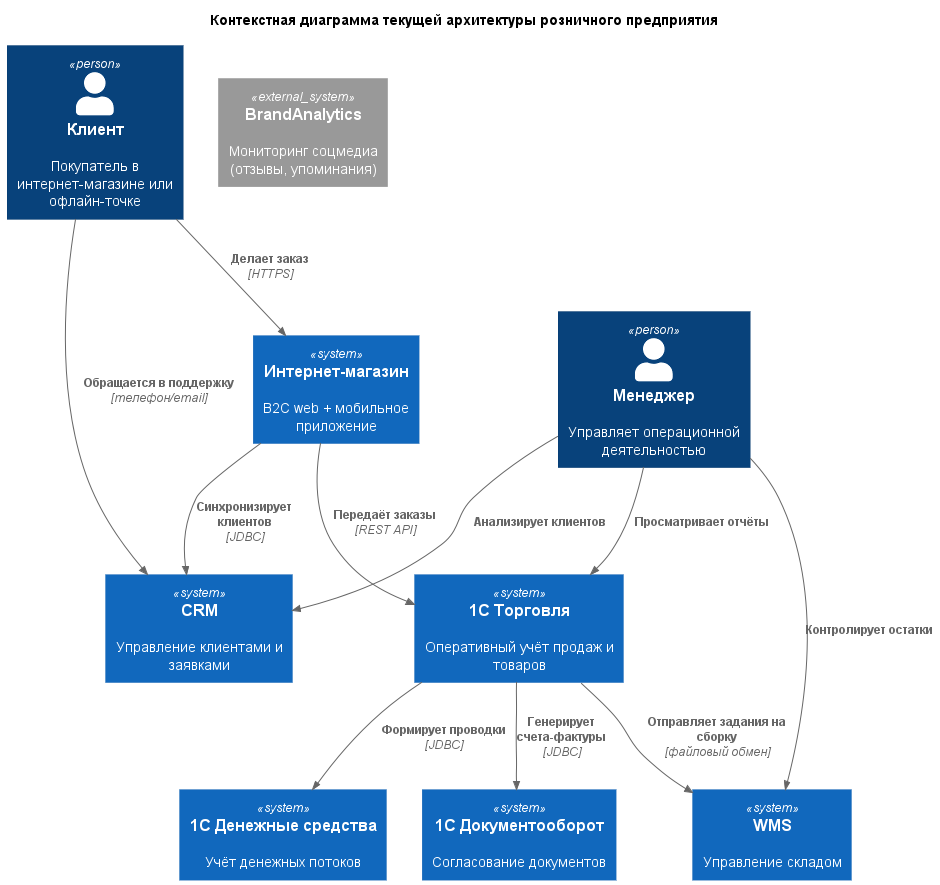
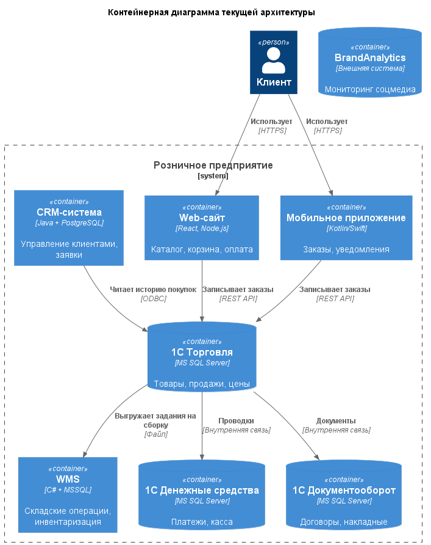
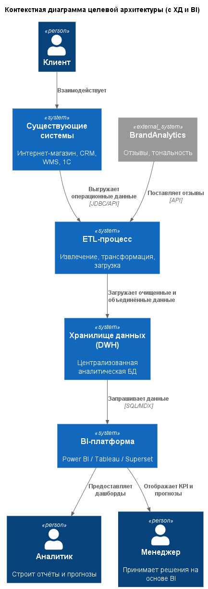
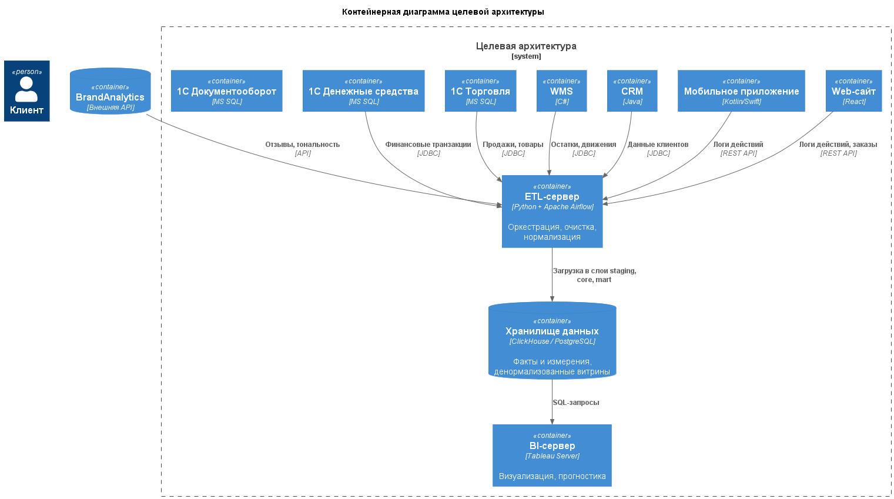
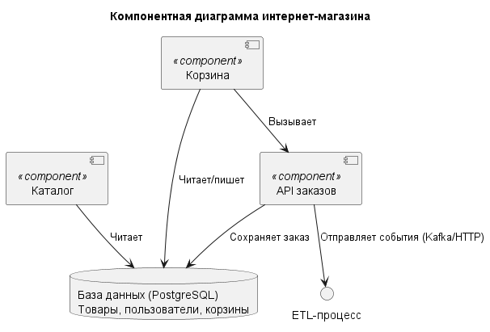
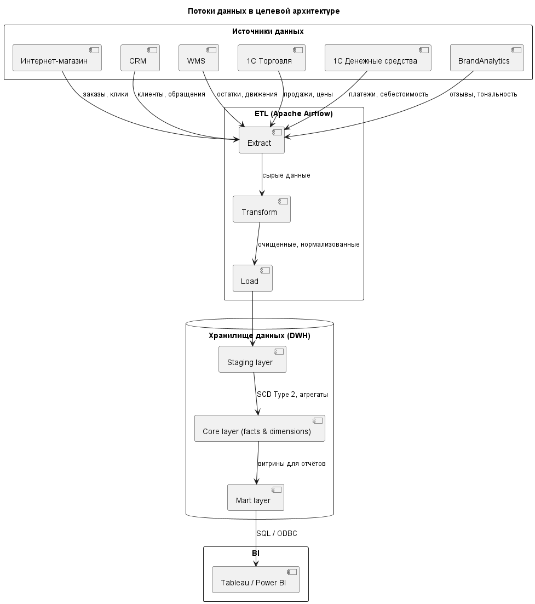
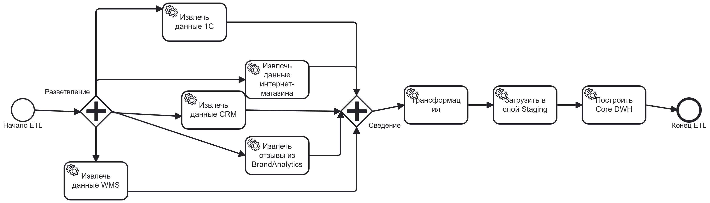
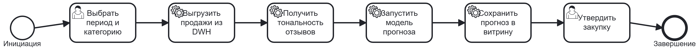

# Задание 3. Архитектура торгового розничного предприятия (C4 model + BPMN)

## Описание задания

Спроектировать функциональную архитектуру розничного предприятия (текущую и целевую) с использованием **C4 model** (`Context`, `Containers`, `Components`) и нотации **BPMN**.  
Определить потоки данных, которые могут быть собраны в хранилище данных (ХД), предложить аналитические сценарии и обосновать типы данных в ХД.  
Разработать BPMN-алгоритмы сбора и анализа данных.

---

## 1. Текущая автоматизация (исходные системы)

Предприятие ведёт торговлю через:
- `Интернет-магазин (B2C)` + мобильные приложения
- `Офлайн-магазин`
- `Склад`
- `Офис`

Используемые информационные системы:

| Система | Назначение |
|---------|-------------|
| Интернет-магазин (B2C) | Продажи через web, каталог, корзина, заказы |
| Мобильные приложения (B2C) | Заказы, личный кабинет, push-уведомления |
| CRM | Управление клиентами, заявки, история взаимодействий |
| WMS | Управление складом (приёмка, отгрузка, остатки) |
| 1С: Торговля | Оперативный учёт продаж, движение товаров, цены |
| 1С: Денежные средства (SD) | Денежные потоки, платежи, касса |
| 1С: Документооборот | Согласование договоров, накладных, внутренних документов |

**Проблемы текущей архитектуры:**
- Данные распределены по изолированным системам (лоскутная автоматизация)
- Нет единого источника истины для аналитики
- Аналитика – по запросу из одной системы, без кросс-функциональных отчётов
- Отзывы из соцмедиа не собираются
- Прогнозирование спроса – субъективно

---

## 2. C4-диаграммы (текущая архитектура)

### 2.1. Контекстная диаграмма

Показывает взаимодействие внешних сущностей (клиент, менеджер, BrandAnalytics) с системами предприятия.

### 2.2. Контейнерная диаграмма

Раскрывает внутренние приложения, базы данных и сервисы текущей архитектуры.

---

## 3. Целевая архитектура (после внедрения системы сбора и анализа)

Целевая архитектура = текущая + **ETL**, **Хранилище данных (DWH)**, **BI-система**.

### 3.1. Контекстная диаграмма

Добавлены ETL-процесс, хранилище данных, BI-платформа и мониторинг соцмедиа.

### 3.2. Контейнерная диаграмма

Показывает интеграцию новых сервисов с существующими системами.

### 3.3. Компонентная диаграмма (пример для интернет-магазина)

Детализирует внутреннее устройство интернет-магазина: каталог, корзину, API заказов и их связи с БД и ETL.

---

## 4. Диаграмма потоков данных

Показывает движение данных от источников (Интернет-магазин, CRM, WMS, 1С, BrandAnalytics) через ETL в слои хранилища данных (Staging → Core → Mart) и далее в BI.

---

## 5. BPMN-процессы

### 5.1. ETL-процесс сбора данных из всех систем

Алгоритм извлечения, трансформации и загрузки данных из источников в хранилище.

**Ключевые шаги:**
1. Старт.
2. Параллельное извлечение данных из:
   - Интернет-магазина
   - CRM
   - WMS
   - 1С Торговля/ДС/ДО
   - BrandAnalytics
3. Сведение потоков.
4. Трансформация (очистка, нормализация, дедупликация).
5. Загрузка в слой Staging.
6. Построение Core DWH (факты и измерения).
7. Завершение.

### 5.2. Процесс прогнозирования закупок

Алгоритм анализа данных из DWH и соцмедиа для прогноза спроса.

**Ключевые шаги:**
1. Инициация прогноза менеджером (выбор периода и категории товаров).
2. Выгрузка исторических продаж из DWH.
3. Получение тональности отзывов из BrandAnalytics.
4. Запуск модели прогноза (ARIMA / XGBoost).
5. Сохранение прогноза в витрину данных.
6. Утверждение объёмов закупки менеджером.
7. Завершение.

---

## 6. Обоснование типов основных данных в ХД

| Тип данных | Атрибуты / Примеры | Обоснование |
|------------|--------------------|--------------|
| `INTEGER` / `BIGINT` | `id_клиента`, `id_товара`, `количество`, `возраст` | Быстрое индексирование, поддержка агрегаций (`SUM`, `AVG`, `COUNT`) |
| `TIMESTAMP` | `дата_заказа`, `дата_отгрузки`, `дата_отзыва` | Необходимо для временных рядов, сезонности, прогнозирования |
| `DECIMAL(15,2)` | `цена`, `выручка`, `себестоимость`, `зарплата` | Финансовая точность (фиксированная точка), исключение ошибок округления |
| `VARCHAR(n)` | `название_товара`, `категория`, `город`, `ФИО` | Строки фиксированной длины для индексов и быстрого поиска |
| `TEXT` | `технологический_стек`, `компетенции`, `полный_текст_отзыва` | Переменная длина, подходит для неструктурированных данных |
| `BOOLEAN` | `флаг_возврата`, `флаг_промо`, `активен_ли_клиент` | Эффективно для фильтрации и условной агрегации |
| `FLOAT` / `DOUBLE` | `коэффициент_тональности`, `процент_скидки` | Только для расчётных коэффициентов (не для денег) |
| `JSON` | `дополнительные_поля`, `метаданные_из_BrandAnalytics` | Гибкость при изменении структуры входящих данных |

**Выбор СУБД для ХД:**  
- **ClickHouse** — предпочтителен для больших объёмов (миллиарды записей) и агрегатов в реальном времени (retail-аналитика).  
- **PostgreSQL** — универсальный выбор, поддержка JSON, хорошая производительность до 10–20 ТБ.  
- **Snowflake / BigQuery** — облачные решения для масштабов enterprise.

---

## 7. Итоговые артефакты

Все диаграммы сохранены в папке `diagrams` в формате PNG.  
Исходные файлы PlantUML (`.puml`) и BPMN (`.bpmn`) доступны для редактирования.

**Содержимое папки `diagrams`:**
- `c4_context_current.png`
- `c4_containers_current.png`
- `c4_context_target.png`
- `c4_containers_target.png`
- `c4_component_online_shop.png`
- `data_flow_diagram.png`
- `ETL_Data_Collection.png`
- `Sales_Forecast_BPMN.png`